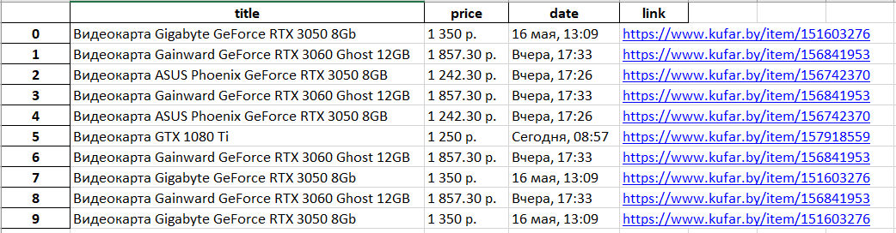

# Brouser automation testing

### In this project I parse a kufar to learn brouser automation testing

## Description
----

### This script offers to you to get a products information of specific categoryIn this case it's a videocards. Scripts parse all ads in every page and save all data in the csv format.

## Run
----
Before running download browser drive.

> pip install -r requirements.txt
> > python main.py

## Result
----

